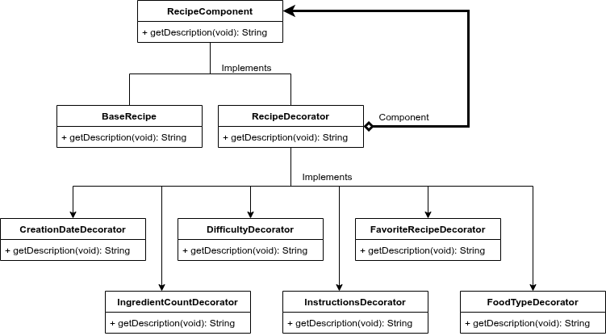
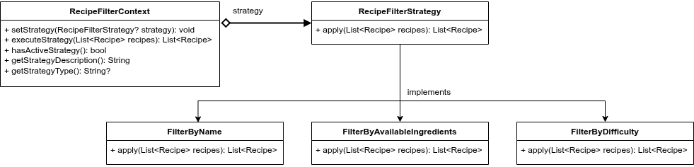

# Gestor de Recetas - Práctica 4

Aplicación Flutter con backend Ruby on Rails para la gestión completa de recetas culinarias.

## Información del Proyecto

**Asignatura**: Desarrollo de Software  
**Práctica**: 4  
**Entrega**: 31/05/2025  
**Defensa**: 05/06/2025  
**Autores**:

- Fernández Arrabal, Carlos
- García Mesa, Antonio Manuel
- Cuesta Bueno, Fernando

## Requisitos del Sistema

### Requisitos Funcionales

#### RF1: Gestión Completa de Recetas (CRUD)

##### RF1.1: Crear Receta

- **Descripción**: El sistema debe permitir crear nuevas recetas con todos sus atributos
- **Datos requeridos**:
  - Nombre de la receta
  - Lista de ingredientes
  - Instrucciones de preparación
  - Nivel de dificultad (numérico)
  - Tipo de comida (dulce/salado)
  - Fecha de creación
- **Criterio de aceptación**: La receta debe ser almacenada y aparecer en la lista de recetas

##### RF1.2: Obtener Recetas

- **Descripción**: El sistema debe permitir recuperar todas las recetas almacenadas
- **Criterio de aceptación**: Debe retornar una lista dinámica con todas las recetas existentes
- **Formato**: Lista de objetos JSON con todos los atributos de cada receta

##### RF1.3: Actualizar Receta

- **Descripción**: El sistema debe permitir modificar los datos de una receta existente
- **Funcionalidades**:
  - Modificar nombre de la receta
  - Actualizar lista de ingredientes
  - Cambiar instrucciones
  - Modificar nivel de dificultad
  - Cambiar tipo de comida
- **Criterio de aceptación**: Los cambios deben persistir y ser visibles al consultar la receta

##### RF1.4: Eliminar Receta

- **Descripción**: El sistema debe permitir eliminar recetas existentes
- **Criterio de aceptación**: La receta eliminada no debe aparecer en futuras consultas

#### RF2: Estructura de Datos de Receta

El sistema debe manejar recetas con la siguiente estructura:

```dart
Recipe {
  name: String
  ingredients: List<String>
  instructions: String
  difficulty: int
  foodType: String
  createdAt: DateTime
  id: dynamic
}
```

#### RF3: Validaciones y Reglas de Negocio

- **RF3.1**: Cada receta debe tener un ID único generado por el sistema
- **RF3.2**: El sistema debe permitir buscar recetas por nombre exacto
- **RF3.3**: Todas las operaciones CRUD deben persistir en base de datos

### Requisitos No Funcionales

#### RNF1: API RestFUL

- El sistema debe exponer operaciones CRUD mediante API REST
- Comunicación asíncrona (uso de `async/await`)
- Manejo de datos en formato JSON

#### RNF2: Arquitectura

- Separación entre capa de datos (API) y capa de dominio (Models)
- Uso de patrones de diseño (Strategy pattern y Decorator pattern)
- Testabilidad completa del sistema

#### RNF3: Calidad y Testing

- Cobertura de testing para todas las operaciones CRUD
- Tests unitarios independientes y reproducibles
- Validación de estados antes y después de operaciones

## Arquitectura del Proyecto

### Patrones de Diseño Implementados

El sistema implementa dos patrones de diseño fundamentales que trabajan conjuntamente para proporcionar flexibilidad y extensibilidad:

#### 1. **Strategy Pattern** - Filtrado Dinámico de Recetas

Permite cambiar algoritmos de filtrado en tiempo de ejecución sin modificar el código cliente.

#### 2. **Decorator Pattern** - Enriquecimiento de Información

Añade funcionalidades adicionales a la visualización de recetas sin modificar su estructura base.

### Diagramas UML de Patrones de Diseño

#### Decorator Pattern - Diagrama Detallado



_Figura 1: Diagrama UML del Patrón Decorator en el sistema de gestión de recetas_

#### Strategy Pattern - Diagrama Detallado



_Figura 2: Diagrama UML del Patrón Strategy en el sistema de gestión de recetas_

## Configuración del Backend (Ruby on Rails)

### Navegar al directorio del backend

```bash
cd practica4/gestor_de_recetas_api
```

### Instalar dependencias de Ruby

```bash
bundle install
```

### Configurar la base de datos

```bash
# Crear la base de datos
rails db:create

# Ejecutar migraciones
rails db:migrate

# (Opcional) Poblar con datos de prueba
rails db:seed
```

### Lanzar el servidor Rails

```bash
rails server
```

El servidor estará disponible en:

- **Local**: `http://localhost:3000`

### Verificar que el backend funciona

```bash
# Probar endpoint de recetas
curl http://localhost:3000/recetas

# Debería retornar un JSON con las recetas (puede estar vacío inicialmente)
```

## Configuración del Frontend (Flutter)

### Navegar al directorio del frontend

```bash
cd practica4/
```

### Instalar dependencias de Flutter

```bash
flutter pub get
```

### Configurar la URL del API según tu entorno

Edita el archivo `lib/services/api_service.dart` y ajusta la URL base:

```dart
class ApiService {
  // Para emulador Android
  // static const String baseUrl = 'http://10.0.2.2:3000';

  // Para navegador web o desarrollo local
  static const String baseUrl = 'http://localhost:3000';
}
```
